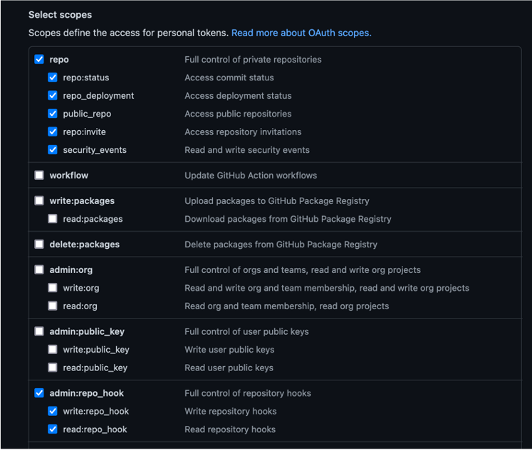
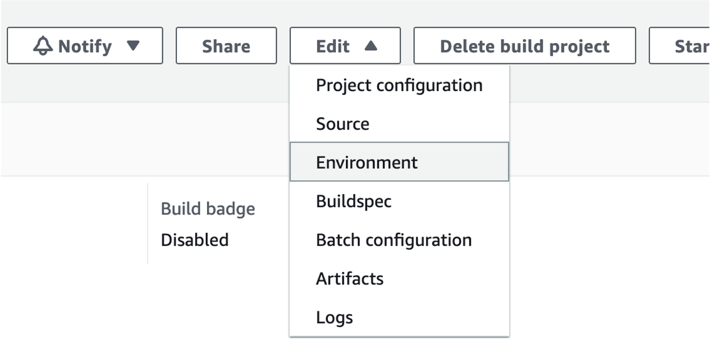
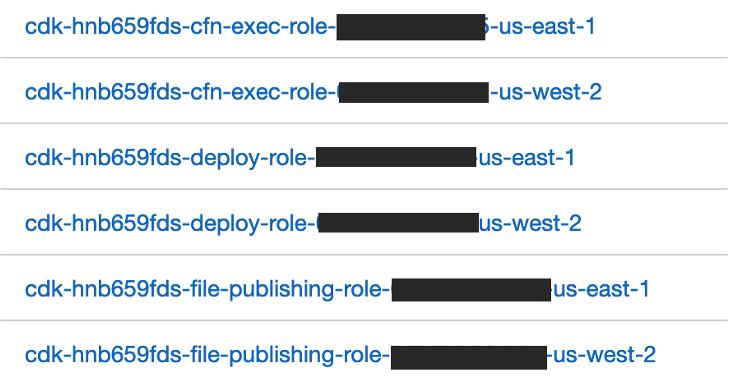
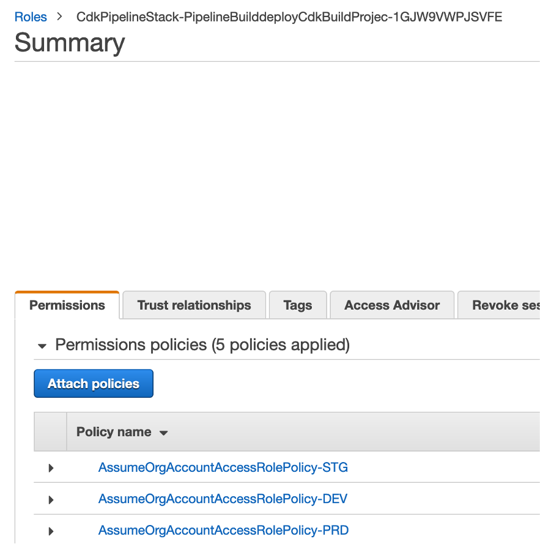
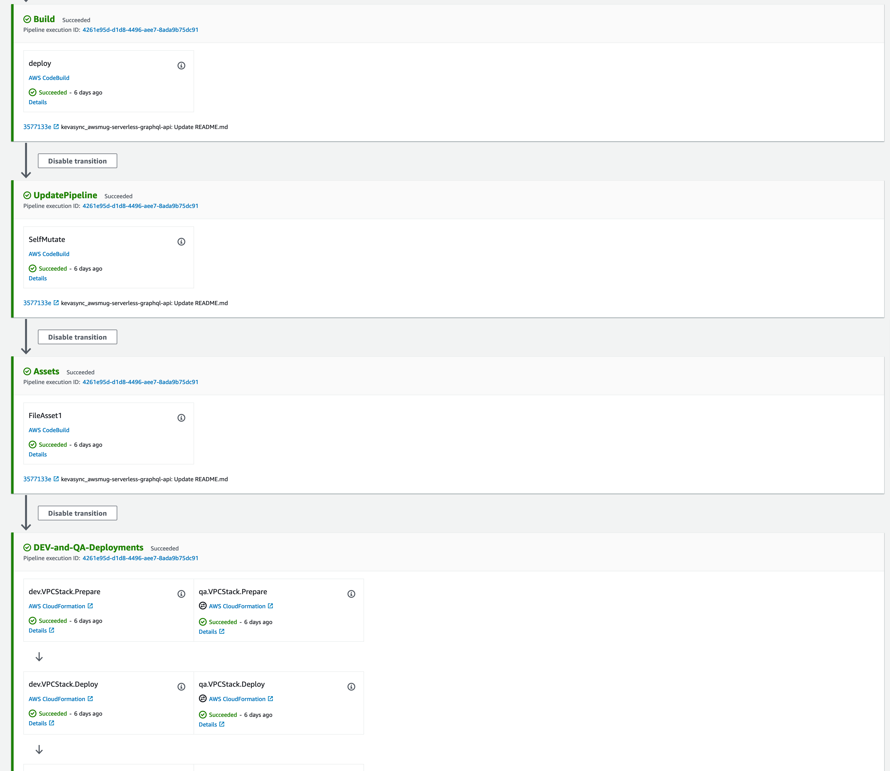

# Build up CI/CD Pipeline with CDK - Multi Account/Region Deployments

In this guide, we will introduce a way to build up CI/CD piplelines to realize services multi account/region deployments using CDK.

&nbsp;

## Stack Architecture

&nbsp;

Below in the graph shows the infrastructure architecture. The whole architecture spreads in four accounts. One account is for deploying pipeline whereas other three accounts are the service accounts for each of stages in development


&nbsp;

##  Cross Account Setup - Console (Optional)
During the deployment, we will need to switch between four AWS accounts to check resources. To avoid the time spending on login and logout between account, instead, we will leverage roles to get access to different consoles. This step will facilitate us switch console by 1-click without logout and login.

1. In each of target accounts (prd, stg, dev), create a role `OrganizationAccountAccessRole` and configure it to trust pipeline account, and attach policy.
   
   

2. In pipeline account, create policies as below for each of the target account and attach to role you use that allows account. Repeat for all accounts.
   
   

3. Use switch role link in menu drop at top right of the console to switch between accounts.
   
     

&nbsp;

##  Regional CDK Bootstrapping

Each account region combo that is deployed to must be bootstrapped. Since it is a cross-account deployment, a trust must be established during this process.

Deploying AWS CDK apps into an AWS environment may require that you provision resources the AWS CDK needs to perform the deployment. These resources include an Amazon S3 bucket for storing files and IAM roles that grant permissions needed to perform deployments. The process of provisioning these initial resources is called bootstrapping. 

1. For each target account/region run the following CLI command (Must be ran as user with appropriate privs in the target account):
    ```
    cdk bootstrap --trust <pipelineAccountId> --cloudformation-execution-policies arn:aws:iam::aws:policy/AdministratorAccess aws://<targetAccountId>/<targetRegion>
    ```

2. Given we are deploying to 2 regions in 3 different accounts, we must run this command 6 times

&nbsp;

##  Initial Deployment of Pipeline

&nbsp;

### Pipeline Overview

`./cdk/bin/pipeline.ts`: Creation of CDK App for Pipeline

`./cdk/lib/cdk-pipeline-stack.ts`: Definition of stacks to deploy, as well as environments to deploy to.

&nbsp;

### Github Access
1. Create a github token [here](https://github.com/settings/tokens/). Set the permission as below
 
   

2. In pipeline account/region, create Secret Manager secret to store access token for GitHub repo.  The token must stored as a plaintext secret with a name of `github-token`:
   
   

&nbsp;

### Deploy Pipeline

1. Clone the repo and run command. When prompted to create security groups/deploy, accept.
   ```
   cdk deploy CdkPipelineStack
   ```

2. Navigate to CodePipeline in Console and cancel the intial build.
3. Set Env Vars in the Build step of the pipeline as below.

    

    

&nbsp;

### Configure Pipeline Role

In pipeline account, create a Policy for each target account to allow Pipeline role to assume Roles created during bootstrap process

1. Get CDK prefix from a target account
   
   

2. Create policy for all 3 accounts
   
   

3. Attach all 3 policies to the Pipeline Build role (Very similar to what we did for cross account access in console)
   
   

&nbsp;

### Run Pipeline
Navigate to Pipeline and Release Changes, app resources will be deployed in three accounts and two regions in each account.

Waves can be used to deploy multiple stages in parrallel. In this example:
- DEV and QA
- PRD and STG Primary 
- PRD and STG Secondary 




&nbsp;

## App Architecture

App structure contains three stacks:

- VPC: Core networking 
- RDS: RDS Postgres Instance (or read replica in multi-region deployment)
- API: Lambda w/ VPC attachment and API gateway 


&nbsp;

## Cleanup
Each Stack (VPC, RDS, API) is deployed independently to each account/region
This allows each to be updated separately.

You will need to go CloudFormation in each account/region and delete the stacks when you want to clean up the resources.

Explore nested stacks if this behavior is not acceptable
